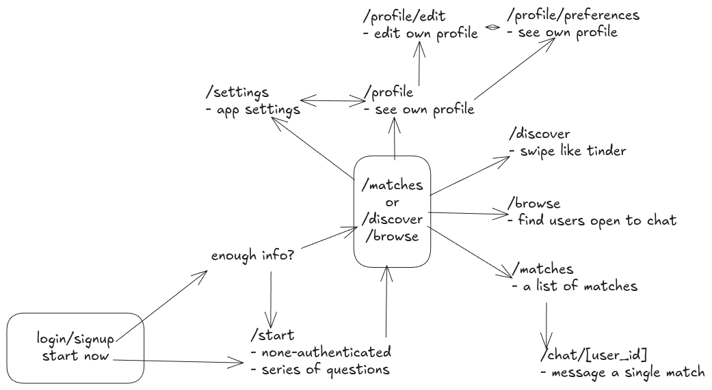

# Caphne.co Development
Development should be thought of in terms of user experience first. Therefore frontend proceeds all else. The backend & DB is then build to store the data and serves frontend experience. User experience-first development is the philosophy of this project. No technical decision is final.

Each developer is expected to do a little bit of designing. We could either cover the feature ourselves end-to-end or split it into reasonable small tasks and work on it with other devs.

##  Foundation
- [x] Nuxt 3 + Tailwind + Supabase setup
- [x] Auth flow (signup, login, logout, middleware)
- [x] Base layout

## Start - onboarding `/start`
- [ ] Frontend: Multi-step form with progress indicator
- [ ] Backend: Profile creation API
- [ ] Database as needed

## Profile
- [ ] View own profile `/profile`
- [ ] Edit profile `/profile/edit`

## Discover `/discover`
Match-finding machanism number 1 - tinder style
- [ ] User's profile card component
- [ ] Swipe mechanics (left/right)
- [ ] Match popup on mutual swipe
- [ ] API endpoints

## Matches `/matches`
Similar to Messenger start screen a list of people you matched with
- [ ] Match list with last message preview
- [ ] Unread indicator

## Browse `/browse`
Match-finding machanism number 2 - social media style
- [ ] Public profile discovery
- [ ] Search/filter

## Chat `/chat/:matchId`
- [ ] Message thread UI
- [ ] Send/receive messages
- [ ] Real-time updates
- [ ] Icebreaker prompt

## Settings `/settings`
- [ ] Account management
- [ ] Language toggle
- [ ] Delete account

